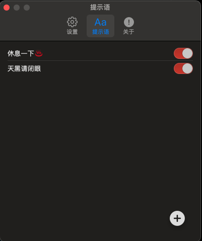

# RestYourEyes

Screen aids on Mac implemented with SwiftUI, countdown display screensavers to prompt eyes to take a break.

|  |  |  |
| ---------------- | ---------------- | ---------------- |

## OS Requirement

macOS 13 minimum for SwiftUI support

## Installation

### Download

Download the [latest release](https://github.com/gao-sun/eul/releases/latest/download/eul.app.zip) directly and drag `.app` file into your `Application` folder.
